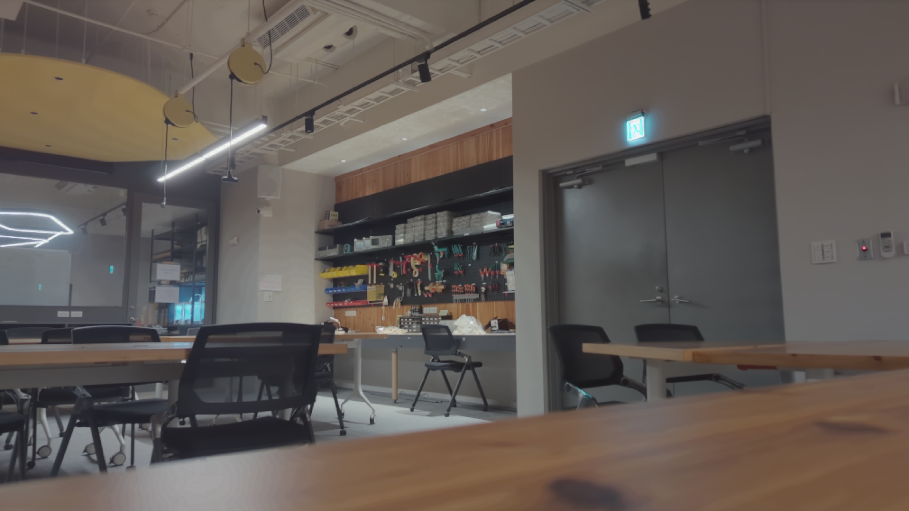
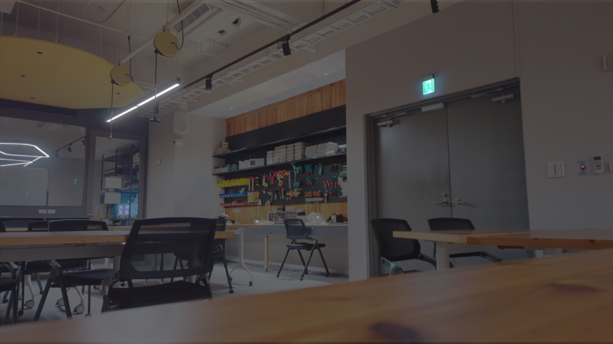
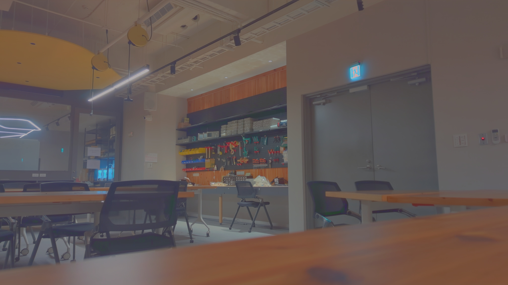

第 17 組： B10902032 李沛宸
Github: https://github.com/MarkymarkLee/VFX_hw1.git
## 1. Comparing Different Results

### 1.1 Comparison of HDR Methods using Fast Bilateral Filtering

| HDR Method      | Results                                                                            | Response Curve                                            | Comments                                                             |
| --------------- | ---------------------------------------------------------------------------------- | --------------------------------------------------------- | -------------------------------------------------------------------- |
| Paul Debevec    |         | ![[hw1/results/paul/dragor/response_curve.jpg\|180]]      | Scales better to show bigger range for HDR image.                    |
| Mitsunaga Nayar |          | ![[hw1/results/nayar/dragor/response_curve.jpg\|180]]     | Small color segment mistakes (3DP on the left), which is less robust |
| Robertson       |  | ![[hw1/results/robertson/dragor/response_curve.jpg\|180]] | Less smooth curve,but is more robust to the points picked.           |
**Analysis:**
Personally, I like Paul Debevec's results best, although it depends a bit on the points chosen (it is not as robust as Robertson's), it results in a better contrast for darker and lighter spaces, which really demonstrates the value of HDR images.
The response curve for Mitsunaga & Nayar is different because it is not plotted on the log space, but instead it it original, since the results are in the range of 0 ~ 1. We are note sure of its real scale so logarithmics results may differ a lot.
The time needed for the algorithms differ by the number of points chosen, which I already tuned to show the results, but overall Debevec's method needs the least amount of time, while Mitsunaga & Nayar's method needs the most time.
### 1.2 Comparison of Tone Mapping Methods using Paul Debevec HDR

| Tone Mapping Method      | Result                                                              | Comments                                                                                                                     |
| ------------------------ | ------------------------------------------------------------------- | ---------------------------------------------------------------------------------------------------------------------------- |
| Fast Bilateral Filtering |  | The contrast is stronger, which means that black is blacker and white is whiter. Also preserves edges better. (looks better) |
| Drago                    |                   | Contrast is not as sharper as Fast Bilateral, but shows the whole image clearly (more real)                                  |
| Mantiuk                  |                | slightly blurry with less luminance                                                                                          |
| Reinhard                 |              | slightly blurry with more luminance                                                                                          |
**Analysis:**
Overall, I like fast bilateral filtering (Durand's method best). It preverse the contrast of the images while also show clearer edges of each part. It captures the light more naturally, too.
However, fast bilateral filtering needs the most time and may differ by how large the gap is between the brightest and the darkest point.
### 1.3 Comprehensive Comparison of All Methods

| Methods        | Paul Debevec                                      | Mitsunaga Nayar                                      | Robertson                                                   |
| -------------- | ------------------------------------------------- | ---------------------------------------------------- | ----------------------------------------------------------- |
| Fast Bilateral |  |  |  |
| Drago          |     |       |          |
| Mantiuk        |    |      |         |
| Reinhard       |   |     |        |

## 2. Implementations
### 2.0 Summary of Implemented Algorithms

- MTB (Median Threshold Bitmap) Algorithm
- Paul Debevec HDR Method
- Mitsunaga & Nayar HDR Method
- Robertson HDR Method
- Fast Bilateral Filtering Tonemapping Algorithm

### 2.1 MTB (Median Threshold Bitmap) Algorithm

#### Implementation Steps:

1. **Image Conversion**: Convert each image to grayscale
2. **Median Calculation**: Compute the median value of each grayscale imageet to align all images with the reference image
3. **Bitmap Creation**: Create a binary bitmap where pixels above median are 1, others 0
4. **Exclusion Mask**: Generate exclusion masks to ignore pixels too close to the median
5. **Pyramid Search**: Implement a hierarchical search to find the best alignment offset
    - Start with a coarse search at low resolutionod
    - Refine the search at higher resolutions
6. **Subpixel Alignment**: Apply the computed offset to align all images with the reference image
    - Construct a system of equations based on pixel values and exposures

Aligned Images
![[hw1/results/nayar/dragor/images.jpg]]
### 2.2 HDR Algorithms

#### Paul Debevec Method

**1. `sample_pixels` (Select Pixels)**
*   **Sample:** Randomly choose a fixed number (`num_samples`) of pixel locations `(y, x)` from the image dimensions.

**2. `recover_response_curve` (Estimate CRF using Least Squares)**
*   **Goal:** Find the inverse Camera Response Function $g$ (mapping pixel value $Z$ to log exposure $ln(E)$) and the log irradiance $ln(E_i)$ for each sampled pixel $i$.
*   **Linear System Setup (per channel):**
    *   Create a large, sparse matrix `A` and a vector `b`.
    *   **Data Fitting Equations:** For each sampled pixel $i$ and each image $j$:
        *   Add an equation: $g(Z_{ij}) - ln(E_i) = ln(\Delta t_j)$.
        *   Apply a weight $w$ (from `weight_function`) to this equation.
    *   **Smoothness Equations:** For each pixel value $z$ (except ends):
        *   Add an equation: $g(z-1) - 2g(z) + g(z+1) = 0$.
        *   Multiply this equation by a smoothness factor `lambda_smooth` and weight $w$.
    *   **Constraint:** Add an equation to fix the curve's scale, e.g., $g(128) = 0$.
*   **Solve:** Use linear least squares (`np.linalg.lstsq`) to solve the system $Ax = b$ for the unknowns $x$ (which contains all $g(z)$ values and all $ln(E_i)$ values).
*   **Extract CRF:** The first 256 values of the solution vector $x$ represent the recovered $g$ (the log response curve).

**3. `create_hdr_image` (Merge LDRs into HDR)**
*   **Weighted Average in Log Domain (per pixel):**
    *   For each input image:
        *   Get the pixel value $Z$.
        *   Use the estimated CRF $g$ to get the log radiance value: $log\_rad = g(Z)$.
        *   Subtract the known log exposure time: $log\_rad = g(Z) - ln(\Delta t)$.
        *   Calculate a weight $w$ (using `weight_function`).
    *   Compute the final log HDR pixel value as the weighted average of these `log_rad` values from all images.
*   **Convert to Linear:** Apply `np.exp()` to the resulting log HDR image to get the final linear HDR radiance map.

#### Mitsunaga Nayar Method

**1. `sample_pixels` (Select Representative Pixels)**
*   **Filter:** Keep only pixel locations `(y, x)` that are non-zero in all images and have strictly increasing brightness values across the image sequence.

**2. `recover_response_curve` (Estimate CRF & Exposure Ratios)**
*   **Model CRF:** Assume the Camera Response Function $g$ (mapping pixel value to radiance) is a polynomial for each color channel.
*   **Iterate Degrees:** Test several polynomial degrees (e.g., 3-6).
*   **Iterative Optimization (per degree, per channel):**
    *   **Estimate CRF Coefficients:** Solve a linear system based on sampled pixel values and current exposure ratio estimates ($R_j$).
    *   **Estimate Exposure Ratios $R_j$:** Update $R_j$ (ratio of exposure $j+1$ to $j$) by averaging $g(Z_{p,q}) / g(Z_{p,q+1})$ using the current CRF $g$.
    *   **Repeat:** Continue until the CRF estimate converges.
*   **Select Best:** Choose the polynomial degree with the lowest error.
*   **Calculate Exposures:** Determine relative exposure factors for each image based on the final $R_j$ values.

**3. `create_hdr_image` (Merge LDRs into HDR)**

*   **Scale Colors:** Calculate and apply scaling factors to align R and B channels relative to G.
*   **Weighted Average (per pixel):**
    *   For each input image:
        *   Use the estimated CRF $g$ to convert the pixel value $Z$ to relative radiance $I = g(Z)$.
        *   Divide radiance $I$ by the image's relative exposure factor.
        *   Apply the color scaling factor.
        *   Calculate a weight (higher for mid-range pixel values).
    *   Compute the final HDR pixel value as the weighted average of these radiance estimates from all images.
#### Robertson Method

**1. `sample_pixels` (Select Pixels)**

*   **Sample:** Randomly choose a fixed number (`num_samples`) of unique pixel locations `(y, x)` from all possible image coordinates.

**2. `recover_response_curve` (Estimate CRF & Irradiance Iteratively)**

*   **Goal:** Find the Camera Response Function $g$ (mapping pixel value $Z$ to relative radiance) and the relative irradiance $E_i$ for each sampled pixel $i$.
*   **Initialization (per channel):**
    *   Initialize $g$ as a linear ramp (normalized so $g(128)=1$).
    *   Initialize $E_i$ for all sampled pixels to 1.
*   **Iterative Optimization:**
    *   **Loop until convergence:**
        *   **Update Irradiances $E_i$:** Keeping $g$ fixed, update the irradiance $E_i$ for each sampled pixel $i$ using a weighted average based on the equation $E_i = \sum_j w(Z_{ij}) g(Z_{ij}) \Delta t_j / \sum_j w(Z_{ij}) (\Delta t_j)^2$.
        *   **Update Response Curve $g(z)$:** Keeping the $E_i$ fixed, update the value of $g(z)$ for each possible pixel value $z$ (0-255) using a weighted average based on the equation $g(z) = \sum_{i,j \text{ where } Z_{ij}=z} w(Z_{ij}) E_i \Delta t_j / \sum_{i,j \text{ where } Z_{ij}=z} w(Z_{ij})$. 
        *   **Normalize $g$:** Rescale $g$ so that $g(128) = 1$.
        *   **Check Convergence:** Stop if the average change in $E_i$ values between iterations is below a threshold.
*   **Convert to Log:** Take the logarithm of the final converged $g$ to get the log response curve (similar to Debevec's output format).

**3. `create_hdr_image` (Merge LDRs into HDR)**

*   Identical to the one used in the Debevec implementation.
*   **Weighted Average in Log Domain (per pixel):**
    *   For each input image:
        *   Use the estimated log CRF $g$ to get the log radiance value: $log\_rad = g(Z)$.
        *   Subtract the known log exposure time: $log\_rad = g(Z) - ln(\Delta t)$.
        *   Calculate a weight $w$ (using `weight_function`).
    *   Compute the final log HDR pixel value as the weighted average of these `log_rad` values from all images.
*   **Convert to Linear:** Apply `np.exp()` to the resulting log HDR image to get the final linear HDR radiance map.

### 2.3 Tone Mapping Algorithmssformation to work in log domain

#### Fast Bilateral Filtering

**1. `fast_bilateral_filter_channel` (Core Filtering Logic)**

*   **Downsample:** Shrink the input image channel.
*   **Process Intensity Segments:** For different intensity ranges (`num_segments`):
    *   Calculate how similar downsampled pixels are to the segment's intensity (`sigma_r`).
    *   Spatially blur (Gaussian `sigma_s`) these similarity weights.
    *   Spatially blur the intensity values weighted by similarity.
    *   Divide the blurred weighted intensities by the blurred weights.
*   **Upsample & Combine:** Enlarge results for each segment and average them to get the final filtered channel.

**2. `fast_bilateral_tonemap` (Tone Mapping Workflow)**

*   **Isolate Luminance:** Convert HDR image to HSV (if color) to work on the Value (brightness) channel.
*   **Filter Luminance:** Apply `fast_bilateral_filter_channel` to the Value channel using spatial (`sigma_s`) and range (`sigma_r`) parameters.
*   **Recombine Color:** Convert back to RGB (if color).
*   **Compress & Display:** Apply log scaling, gamma correction, normalize to [0,1], and convert to 8-bit LDR.
#### Drago & Mantiuk & Reinhard Tone Mapping

Implemented directly using opencv.
